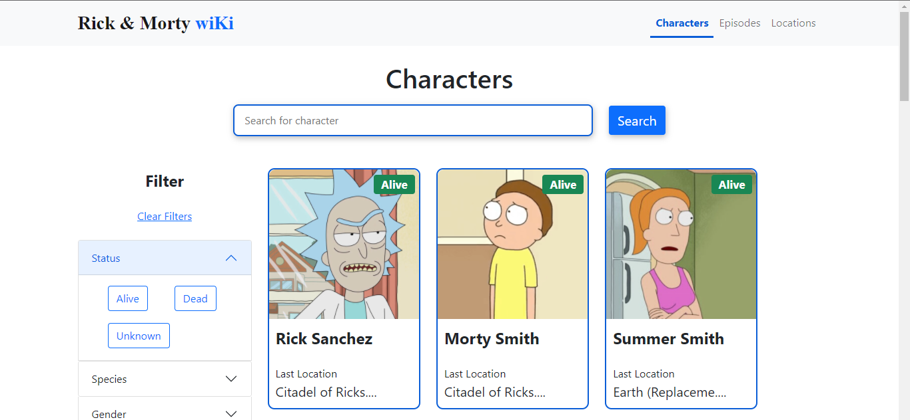
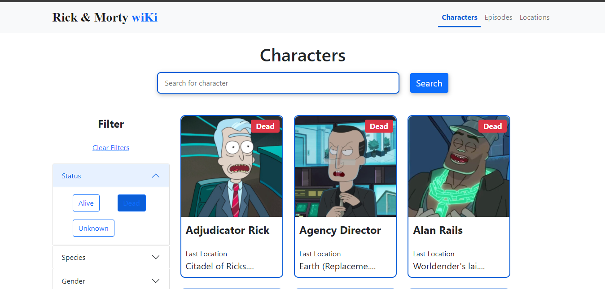
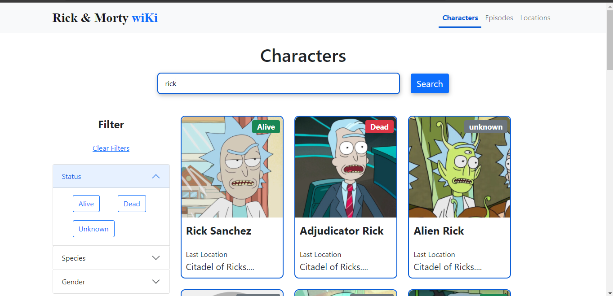

# Rick And Morty WiKi

This project was bootstrapped with [Create React App](https://github.com/facebook/create-react-app).
The Rick and Morty WiKi is a react  app based on the television show [Rick and Morty](https://www.adultswim.com/videos/rick-and-morty).

**💻Live Demo (https://rick-morty-wiki.herokuapp.com/)**

**👉API (https://rickandmortyapi.com/)**

## Features
<li>Dynamic Filtering</li>
<li>Searching by Characters</li>
<li>Responsive Design</li>
 

 
 
<header><strong><u>Filtering</u></strong></header>

 
 
<header><strong><u>Searching</u></strong></header>

### Modules Used

<li>React Paginate</li>
<li>React Router DOM</li>
<li>Bootstrap</li>